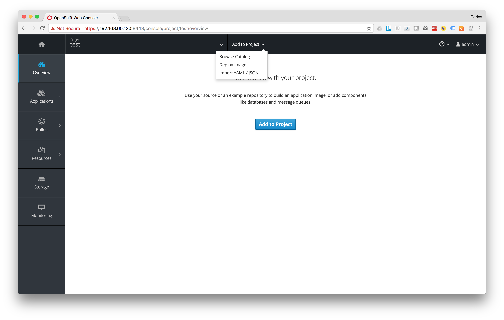
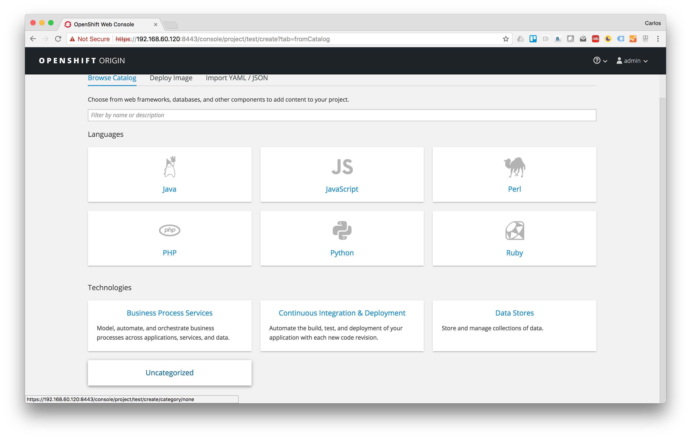
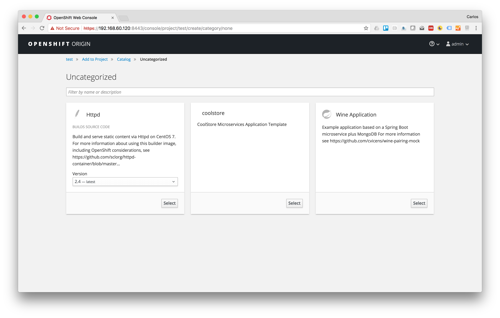
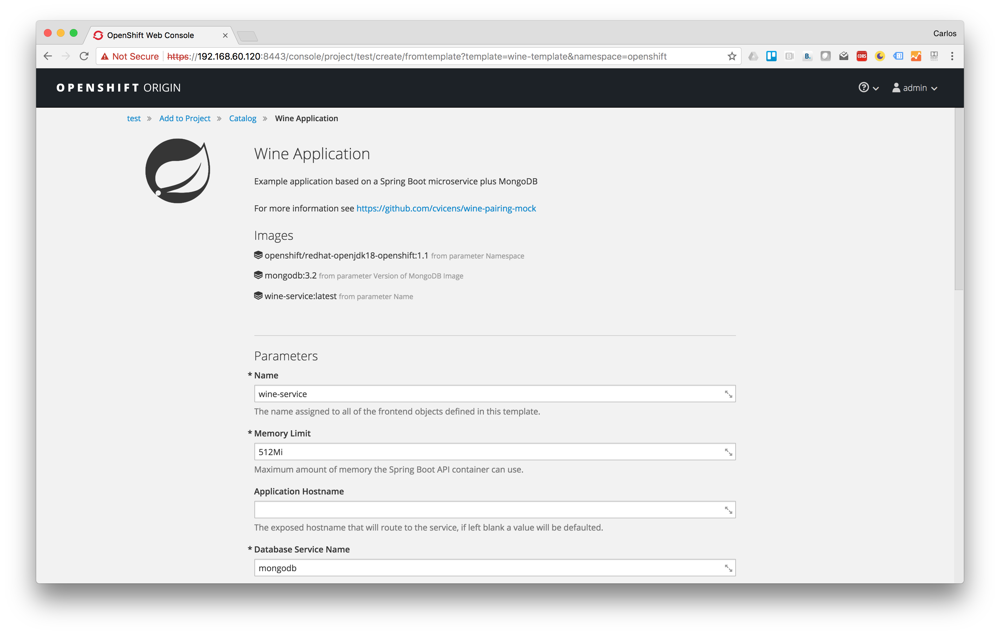

# Introduction

This is just an example application that includes an Spring Boot microservice that relies on a MongoDB

This GIT repo contains both the Spring Boot microservice code and the Openshift template

It is assumed that you:
* Have some basic knowledge about Openshift
* Have an Openshift CLI installed and setup
* Have access to an Openshift environment up and running (or oc cluster up otherwise)
* Have permissions to create projects

Steps to use the template.

# Create a new project
Use the oc CLI or the web console.

```
$ oc new-project wine-project
Now using project "wine-project" on server "https://192.168.60.120:8443".

You can add applications to this project with the 'new-app' command. For example, try:

    oc new-app centos/ruby-22-centos7~https://github.com/openshift/ruby-ex.git

to build a new example application in Ruby.
```

# Deploying the template

There are two ways to deploy our template in the project we just created: one involves adding our template to the 'openshift' project, the other just processing the template and creating the objects defined in it.

## Processing the template

```
$ oc process -f wine-project-template.yaml | oc create -n wine-project -f -
secret "mongodb" created
persistentvolumeclaim "mongodb" created
deploymentconfig "mongodb" created
service "mongodb" created
imagestream "wine-service" created
buildconfig "wine-service" created
deploymentconfig "wine-service" created
service "wine-service" created
route "wine-service" created
```

## Adding our template to the 'openshift' project

Let's use the the 'create' command to add our template to the 'openshift' project, this way our template will be seen in the service catalog from any project.

**Note:** to do this you need permissions on 'openshift' project, something easy if you are using 'oc cluster up' otherwise you'd need to ask your Openshift administrator.

```
$ oc create -f wine-project-template.yaml -n openshift 
```

After successfully adding our template you can use the web console to deploy our template. To do so, go to Add Projects and click on Browse Catalog.



You'll find our template under the 'Uncategorized' category. Click on it to be able to use our template.



Now you have to click on the 'select' button of our template.



Finally modify parameters to fit your needs or just leave the default values.



# Testing the application
Let's list the routes exposed in our project, there should be just one.

```
$ oc get route -n wine-project
NAME           HOST/PORT                                              PATH      SERVICES       PORT      TERMINATION   WILDCARD
wine-service   wine-service-wine-project.apps.192.168.60.120.nip.io             wine-service   <all>                   None
```
Now let's invoke the 'init' endpoint to populate the DB with some test data.

```
$ curl -k http://wine-service-wine-project.apps.192.168.60.120.nip.io/init
The End
```
Finally let's test the logic of the app that get the list of wines for a certain type of wine in a certain region.

```
$ curl -k http://wine-service-wine-project.apps.192.168.60.120.nip.io/wine?wineType=DRY_WHITE&region=ALBARIÑO
{"id":3,"status":"SUCCESS","description":"SUCCESS","wines":[]}
```

# Sample Jenkins pipe-line

Fit next example to your needs....
```
oc process -f ./wine-project-pipeline-template.yaml \
   -p NAME=cellar \
   -p ROOT_GIT_URL=http://mitzi-gogs.cloudapps-579a.oslab.opentlc.com/gogs/wine \
   -p GIT_CONTEXT_DIR=cellar \
   -p CICD_PROJECT_NAME=wine-cicd \
   -p DEVELOPMENT_PROJECT_NAME=wine-dev \
   -p STAGE_PROJECT_NAME=wine-stage \
   -p NEXUS_URL=http://nexus3-coolstore-infra.cloudapps-579a.oslab.opentlc.com \
   -p SONARQUBE_URL=http://sonarqube-coolstore-infra.cloudapps-579a.oslab.opentlc.com \
   -p SONARQUBE_TOKEN=96c88bba952681ccf8f30fc0545a16cb4a9a5aea \
   -p SMOKE_TEST_URL_DEV=http://wine-cellar-wine-dev.cloudapps-579a.oslab.opentlc.com/ \
   -p SMOKE_TEST_URL_STAGE=http://wine-cellar-wine-stage.cloudapps-579a.oslab.opentlc.com/ \
   -p SMOKE_TEST_URI=wine?wineType=bold_red\&region=rioja | oc create -n wine-cicd -f -
```


